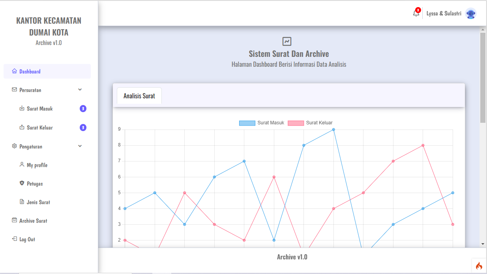

  

 

    
Aplikasi Arsip Surat Masuk Dan Surat Keluar.

  

<h2>Changelog</h2>

Progress On 02/03/2023:

<ul>
    <li><a href="/public/assets/document/struktur.md">Initial upload of CodeIgniter 4 framework to Github</a></li>
</ul> 

Thank You!

